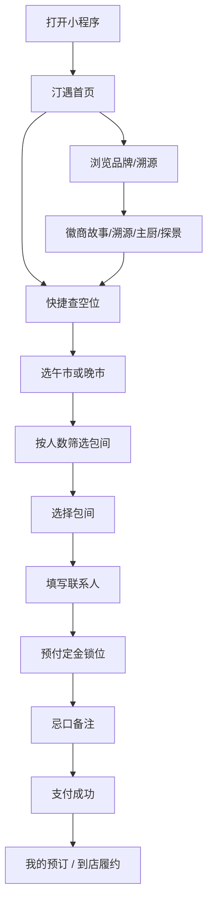

# 桥水汀微信小程序 · 产品需求文档（PRD）概要

| 项目 | 说明 |
|------|------|
| 品牌 | 桥水汀 |
| 品类定位 | 新派徽菜 · 融合菜 |
| 业态 | 中高端商务宴请餐厅 |
| 客单价 | 人均 ¥200–1000 |
| 核心客群 | 35–55 岁企业主、商务接待负责人、政府公务宴请决策人 |
| 品牌关键词 | 私密性 · 仪式感 · 徽商文化底蕴 |
| 文档版本 | v1.1（一期 · 精简版） |
| 一期目标 | 完成「品牌信任 → 定金订座 → 到店履约」闭环；**不做**外卖式单点、不做线上点餐 |

> v1.1 变更：移除「私宴」专属订餐模块、邀请函功能、代客泊车与桌面布置选项、尊享套餐锁位；锁位方式简化为仅「定金」；底部导航由五栏收敛为四栏。

---

## 1. 产品定位与价值主张

### 1.1 一句话定位

为商务宴请决策人提供「有面子、省心、可掌控」的私密包间订座入口。

### 1.2 与普通餐饮小程序的差异

| 维度 | 普通餐饮小程序 | 桥水汀 |
|------|----------------|--------|
| 核心动作 | 单点外卖 / 堂食扫码点菜 | 仅私密包间**订座**，不做线上点餐与外卖 |
| 品牌 | 图文轮播、优惠海报 | 徽商叙事、食材溯源、主厨专访、包厢探景 |
| 订座 | 留电话、人工确认 | 实时空位、分厅分时段、**强制预付定金**锁位 |
| 履约 | 到店再沟通 | 忌口备注前置、专属「小桥」客服直连、地址一键地图定位 |

### 1.3 一期核心 KPI

- 订座转化率（进入订座 → 支付成功）
- 定金支付完成率
- 客服致电 / 到店定位使用率
- 复订率（同 openid 二次及以上确认预订）

---

## 2. 底部导航（Tab Bar）· 四个一级菜单

**视觉规范**：黛青底（`#2F3A3C` 系）/ 琥珀金选中态（`#C4A35A`）；文案采用宋体/楷体类衬线字，突出高端感（一期采用纯文字导航，暂不使用位图图标）。

| 序号 | 名称 | 职责 |
|------|------|------|
| 1 | **汀遇** | 首页：品牌氛围、入口聚合、时令展示、快捷订座 |
| 2 | **溯源** | 品牌文化：徽商故事、招牌菜食材溯源、主厨专访、包厢 VR/视频探景 |
| 3 | **订座** | 智能订座：实时空位、分厅分时段、定金锁位、忌口备注 |
| 4 | **我的** | 我的预订、联系「小桥」客服、餐厅地址与地图定位 |

**命名逻辑**：「汀遇」呼应品牌；「溯源」强调文化深度；「订座」直指核心决策动作；「我的」承接履约与复访。

---

## 3. 核心用户操作路径

### 3.1 主流程图

### 3.2 路径说明（文字版）

1. **打开小程序** → 进入「汀遇」首页（沉浸 Hero + 单一 CTA「即时订座」）。
2. **信任建立（可选）**：进入「溯源」浏览徽商故事 / 食材溯源 / 主厨专访 / 包厢探景，再回到订座。
3. **查空位订座**：选日期 → 午市/晚市 → 填人数 → 系统过滤可选包间 → 选厅 → 填联系人 → 预付定金 → 忌口备注 → 支付成功。
4. **履约**：在「我的」查看预订；如需沟通可一键致电「小桥」客服，或对餐厅地址一键地图定位导航到店。

### 3.3 订座关键业务规则

| 规则 | 说明 |
|------|------|
| 人数 ≤17 | 可选适配的独立包间：垂虹居（≤10）、羡鱼轩（≤14）、桥瑜汀（≤17）（以各厅后台 `min_guests` / `max_guests` 为准） |
| 人数 11-20 | 另可选大包间徽来堂 |
| 人数 >20 | 三个小包间隔断可拆卸，任意拼间连通：羡鱼轩+垂虹居 ≤24、桥瑜汀+垂虹居 ≤27、桥瑜汀+羡鱼轩 ≤31、三间全拼 ≤41 |
| 拼间兜底 | 单间容得下但全部订满时，同样展示可拼间方案 |
| 徽来堂 | **唯一**带 KTV；列表与详情页必须标注「含 KTV」 |
| 分时段 | 午市 / 晚市；选时段后展示该厅实时状态：可订 / 已订 / 暂不开放 |
| 强制预付 | 提交预订必须预付**定金（按餐标）**后锁位 |
| 支付前锁定 | 进入支付页后短时 `held`，超时未付释放为空位 |
| 忌口备注 | 可选：忌口清单（不辣/忌葱/忌蒜等）+ 自由文本备注 |

### 3.4 包间策略（一期落地约定）

| 包间 | 属性 | 人数引导 | 特殊标注 |
|------|------|----------|----------|
| 桥瑜汀 | 中小 | ≤17 | 隔断可拆卸，可拼间 |
| 羡鱼轩 | 中小 | ≤14 | 隔断可拆卸，可拼间 |
| 垂虹居 | 中小 | ≤10 | 隔断可拆卸，可拼间 |
| 徽来堂 | 大包 + KTV | 11-20 | 庆典 / 欢唱 |
| 拼间 | 两间/三间连通 | ≤41（三间全拼） | 容量为组成厅之和 |

> 各厅容量与是否 KTV **禁止写死在前端**，一律以后台 `rooms` 配置为准。

---

## 4. 两大核心功能模块

### 4.1 品牌文化「溯源」（区别于普通展示）

不做简单图文轮播，采用沉浸式章节结构。

#### 4.1.1 信息架构

| 板块 | 内容要点 | 交互建议 |
|------|----------|----------|
| **徽商叙事轴** | 章节长页：「贾而好儒 → 礼遇宾客 → 桥水汀今日」 | 沉浸滚动 + 章节锚点；少轮播 |
| **招牌菜溯源** | 以臭鳜鱼等为例：产地、节气、选材标准、厨法要点 | 横滑卡片 → 溯源详情弹窗 |
| **主厨专访** | 人物大图 + 短视频/音频摘录 +「一道代表菜背后的融合逻辑」 | 强化商务「选对地方」的信任背书 |
| **包厢探景** | 四厅网格：桥瑜汀、羡鱼轩、垂虹居、徽来堂；短视频漫游或 VR/全景 | 徽来堂额外展示 KTV 区；全屏探景时降低 UI 噪音 |

#### 4.1.2 氛围交互

- 章节切换：缓入缓出（约 300–450ms）
- 背景音乐：古琴或雨声白噪音；**默认关闭**，首页顶栏可开关

---

### 4.2 智能订座（核心痛点）

#### 4.2.1 页面流程

1. 选择日期  
2. 选择午市 / 晚市  
3. 填写就餐人数 → 系统自动过滤可选包间池  
4. 四厅空位看板（状态色见下）  
5. 包间详情：容量、是否 KTV、探景入口、餐标定金说明  
6. 确认页：填写联系人 → 预付定金（唯一锁位方式）→ 忌口备注  
7. 提交成功页：订单摘要、到店须知，跳转「我的」或返回首页

#### 4.2.2 空位状态视觉

| 状态 | 含义 | 视觉 |
|------|------|------|
| 可订 | `available` | 黛青 |
| 已订 | `booked` | 浅灰，不可点 |
| 锁定中 | `held`（本人支付中） | 琥珀金描边 |
| 关停 | `blocked` | 浅灰 +「暂不开放」 |

#### 4.2.3 忌口备注表单

| 字段 | 类型 | 说明 |
|------|------|------|
| 忌口清单 | 多选 + 备注 | 预设：不辣、忌葱、忌蒜；可补充自由文本 |

> 已移除「代客泊车」开关与「桌面布置」选项。

---

## 5. 视觉与交互规范（一期）

| 项目 | 规范 |
|------|------|
| 风格 | 新中式极简美学 |
| 主色 | 黛青色（深蓝灰，建议 `#2F3A3C` 系） |
| 点缀 | 琥珀金（建议 `#C4A35A`） |
| 字体 | 宋体 / 楷体类衬线字（标题与品牌）；正文可读性优先的衬线或细黑体 |
| 背景肌理 | 徽派马头墙剪影或宣纸质感，低对比，不抢内容 |
| 转场 | 舒缓缓动，约 300–450ms |
| BGM | 古琴 / 雨声；默认关；首页顶栏可开 |
| 首页原则 | 首屏仅：品牌 + 一句文案 + 单一 CTA（即时订座）+ 全宽氛围视觉；无统计条、无促销贴纸、无卡片墙 |

首页楼层线框详见：[homepage-wireframe.md](./homepage-wireframe.md)  
后台字段字典详见：[admin-data-model.md](./admin-data-model.md)

---

## 6. 「我的」页最小功能集

- 我的预订（状态、定金、厅房、时段、人数、忌口）
- 联系「小桥」客服（一键致电）
- 餐厅地址展示 + 一键地图定位（`wx.openLocation`）
- 企客/联系人信息（姓名、手机，订座时自动带出）

> 已移除：邀请函记录、私宴订单、偏好与服务（含「我的」页内氛围音开关，氛围音开关保留在首页顶栏）。

---

## 7. 一期范围与非目标

### 7.1 一期做

- 四厅订座 + 午市/晚市实时空位
- 定金（按餐标）强制预付锁位
- 忌口备注
- 溯源四板块（徽商叙事、食材溯源、主厨专访、包厢探景视频/VR 链出）
- 「我的」预订管理 + 客服致电 + 地址地图定位
- 后台：包间、排期、预订、内容、支付流水的最小管理能力

### 7.2 一期不做

- 外卖单点 / 外送 / 线上点餐
- 专属订餐「私宴」（位上套餐、私宴配餐制）
- 定制邀请函
- 代客泊车、桌面布置、尊享套餐锁位
- 积分商城、复杂会员等级体系
- 公域广告投放后台、多门店连锁

---

## 8. 验收要点（产品侧）

1. 人数 ≤10 与 >10 时，可选包间池过滤正确；徽来堂始终展示 KTV 标识。  
2. 未支付定金无法完成锁位；超时 `held` 自动释放。  
3. 锁位方式仅「定金」，无尊享套餐等其他选项。  
4. 确认页仅「忌口清单」，无代客泊车 / 桌面布置。  
5. 全站无「私宴 / 专属订餐」入口，无「邀请函」入口。  
6. 「我的」页可正常致电「小桥」客服并对餐厅地址地图定位。  
7. 首页首屏为单一「即时订座」CTA，无促销贴纸/统计条；视觉符合黛青 + 琥珀金规范。  
8. 后台可配置四厅容量与排期，前端不写死厅房规则。  

---

## 9. 相关文档

- [首页布局线框](./homepage-wireframe.md)
- [后台核心数据字段](./admin-data-model.md)
